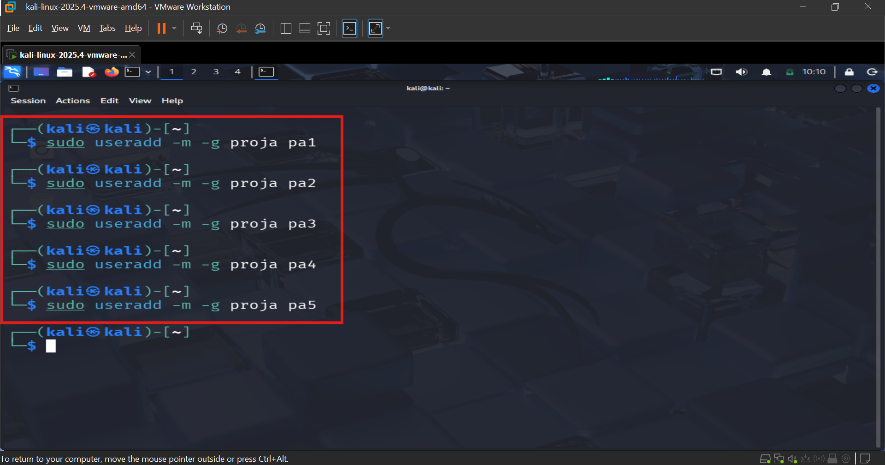
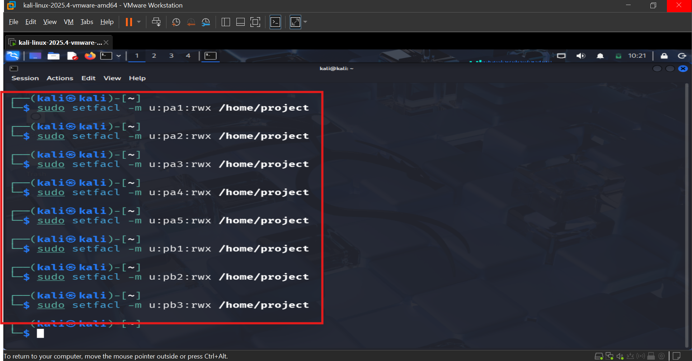
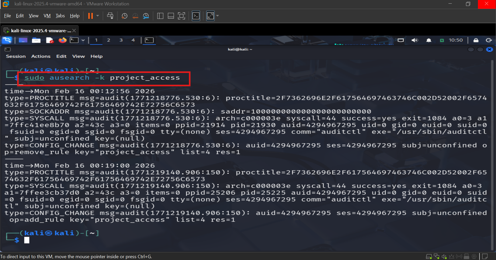
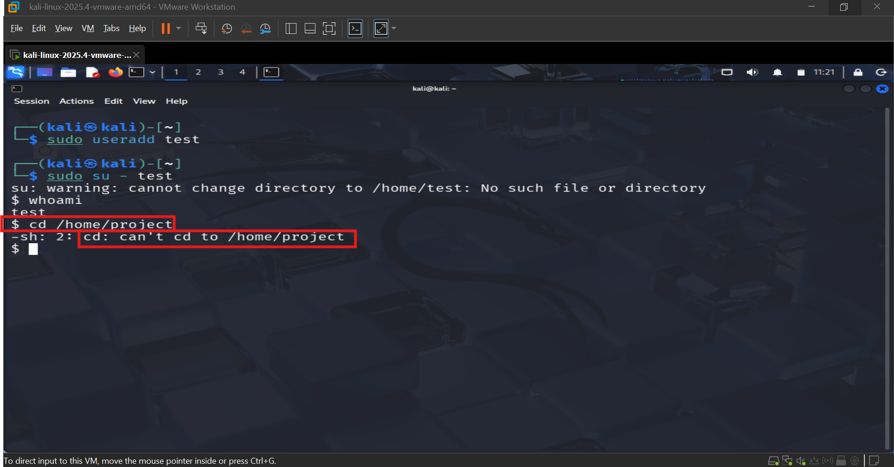
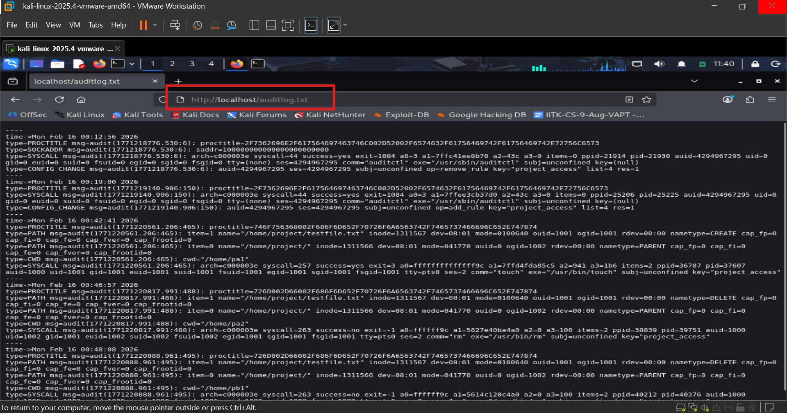

# Secure File Storage and Access Management for Project Teams

## 📌 Project Overview

This project demonstrates the implementation of a secure file storage and access management system for project teams in a Linux environment. The solution was designed to strengthen file security, enforce role-based access control, monitor user activities, and generate security reports for auditing purposes.

The project simulates a real-world organizational environment where multiple project teams require controlled access to shared resources while ensuring confidentiality, integrity, accountability, and compliance with security policies.

---

## 🎯 Objective

To develop a secure file storage and access management system for finance teams at Globex Financial by implementing:

- User and group-based access controls
- Access Control Lists (ACLs)
- Command history management
- Security violation monitoring
- Audit logging and reporting
- Web-based audit report access

The solution aims to prevent unauthorized access and modifications while ensuring compliance with organizational audit requirements.

---

## 🚀 Features

### User & Group Management
- Creation of project-specific user groups
- User account provisioning
- Role-based access control (RBAC)
- Controlled access to shared resources

### Secure File Storage
- Dedicated project directory creation
- Permission-based access restrictions
- Group ownership management
- Sticky bit implementation to prevent unauthorized file deletion

### Access Control Lists (ACLs)
- Fine-grained user permissions
- Read, write, and execute access management
- Default ACL inheritance for newly created files
- Protection against unauthorized modifications

### Command History Management
- Bash shell configuration
- User command history restrictions
- Enhanced accountability and monitoring

### Security Monitoring & Auditing
- Auditd installation and configuration
- Real-time file access monitoring
- Logging of read, write, execute, and attribute changes
- Security event tracking

### Web-Based Reporting
- Apache web server deployment
- Automated audit log publishing
- Authentication-protected report access
- Centralized monitoring interface

### Automated Reporting
- Cron job scheduling
- Automatic audit log updates
- Continuous reporting mechanism

---

## 🛠️ Technologies Used

| Technology | Purpose |
|------------|----------|
| Linux (Ubuntu) | Operating System |
| Bash Shell | Command-line administration |
| ACL (Access Control Lists) | Fine-grained permission control |
| Auditd | Security auditing and monitoring |
| Apache2 | Web-based report system |
| Cron | Task automation |
| User & Group Management | Access control implementation |

---

## ⚙️ Implementation Steps

### Step 1: User and Group Creation

Created separate groups for different project teams.

```bash
sudo groupadd proja
sudo groupadd projb
```

Created users and assigned them to corresponding groups.

```bash
sudo useradd -m -g proja pa1
sudo useradd -m -g proja pa2
```

---

### Step 2: Secure Directory Configuration

Created a centralized project directory.

```bash
sudo mkdir /home/project
```

Configured ownership and permissions.

```bash
sudo chmod 770 /home/project
```

---

### Step 3: Access Control Lists (ACLs)

Assigned granular permissions to users.

```bash
sudo setfacl -m u:pa1:rwx /home/project
```

Applied default ACL policies.

```bash
sudo setfacl -d -m u::rwx /home/project
```

Enabled sticky bit protection.

```bash
sudo chmod +t /home/project
```

---

### Step 4: Command History Configuration

Configured user shell settings.

```bash
sudo chsh -s /bin/bash pa1
```

Restricted command history size.

```bash
HISTSIZE=10
```

---

### Step 5: Security Monitoring with Auditd

Installed Auditd.

```bash
sudo apt install auditd -y
```

Configured monitoring rules.

```bash
sudo auditctl -w /home/project -p rwxa -k project_access
```

Verified logged events.

```bash
sudo ausearch -k project_access
```

---

### Step 6: Web-Based Reporting System

Installed Apache2.

```bash
sudo apt install apache2
```

Published audit logs.

```bash
ausearch -k project_access >> /var/www/html/auditlog.txt
```

Protected reports using authentication.

```apache
AuthType Basic
Require valid-user
```

---

## 🧪 Testing & Validation

The following tests were performed:

### File Access Testing
- Verified authorized user access
- Verified unauthorized user restrictions
- Tested file creation and modification

### File Deletion Protection
- Validated sticky bit functionality
- Prevented unauthorized deletion

### Access Restriction Testing
- Created unauthorized users
- Confirmed access denial

### Command History Testing
- Verified command history limits
- Confirmed shell configuration

### Audit Log Testing
- Generated security events
- Confirmed event logging
- Verified audit rule functionality

### Web Report Testing
- Accessed audit reports through browser
- Verified authentication controls

---

## 📸 Screenshots

The following screenshots highlight the key implementation stages and security controls configured in this project.

### 1. User Account and Group Creation

This screenshot demonstrates the creation of project-specific groups and user accounts used to implement Role-Based Access Control (RBAC) within the system.



**Report Reference:** Step 2.2 – User Account and Group Creation

---

### 2. ACL Configuration

This screenshot shows the configuration of Access Control Lists (ACLs) used to provide fine-grained permissions and secure access to the project directory.



**Report Reference:** Step 2.5 – Configure ACLs to Restrict File Modifications

---

### 3. Audit Log Output

This screenshot displays the output generated by the Auditd service using the `ausearch -k project_access` command, which records and monitors file access activities and security events.



**Report Reference:** Step 4.9 – Test the Configuration (`ausearch -k project_access`)

---

### 4. Unauthorized Access Attempt

This screenshot demonstrates an access attempt by an unauthorized user and validates that the implemented security controls successfully prevent unauthorized access to protected resources.



**Report Reference:** Step 6.2 – Unauthorized Access Attempt

---

### 5. Web-Based Audit Report System

This screenshot shows the web-based reporting interface used to access audit logs through the Apache web server with authentication controls enabled.



**Report Reference:** Step 6.5 – Test the Web-Based Report System

---

## 📄 Project Report

A detailed project report documenting the complete implementation, user and group configuration, ACL setup, access control validation, audit logging, web-based reporting system, screenshots, testing procedures, and security analysis is included in this repository.

📄 **Report:** `Project_Report/Secure_File_Storage_and_Access_Management_Project.pdf`

---

## ✅ Project Outcomes

- Successfully implemented secure file storage and access control.
- Restricted unauthorized access to sensitive project resources.
- Prevented unauthorized file modifications and deletions.
- Enabled comprehensive audit logging and monitoring.
- Improved accountability through command history tracking.
- Developed a centralized web-based reporting mechanism.
- Demonstrated practical implementation of Linux security administration concepts.

---

## 🎓 Learning Outcomes

Through this project, the following cybersecurity and system administration concepts were applied:

- Linux User and Group Management
- Access Control Lists (ACL)
- Role-Based Access Control (RBAC)
- Linux File System Security
- Security Auditing and Monitoring
- Apache Web Server Administration
- Bash Shell Configuration
- Automation using Cron Jobs
- Security Compliance and Reporting

---

## 📄 License

This project is intended for educational, academic, and learning purposes.
